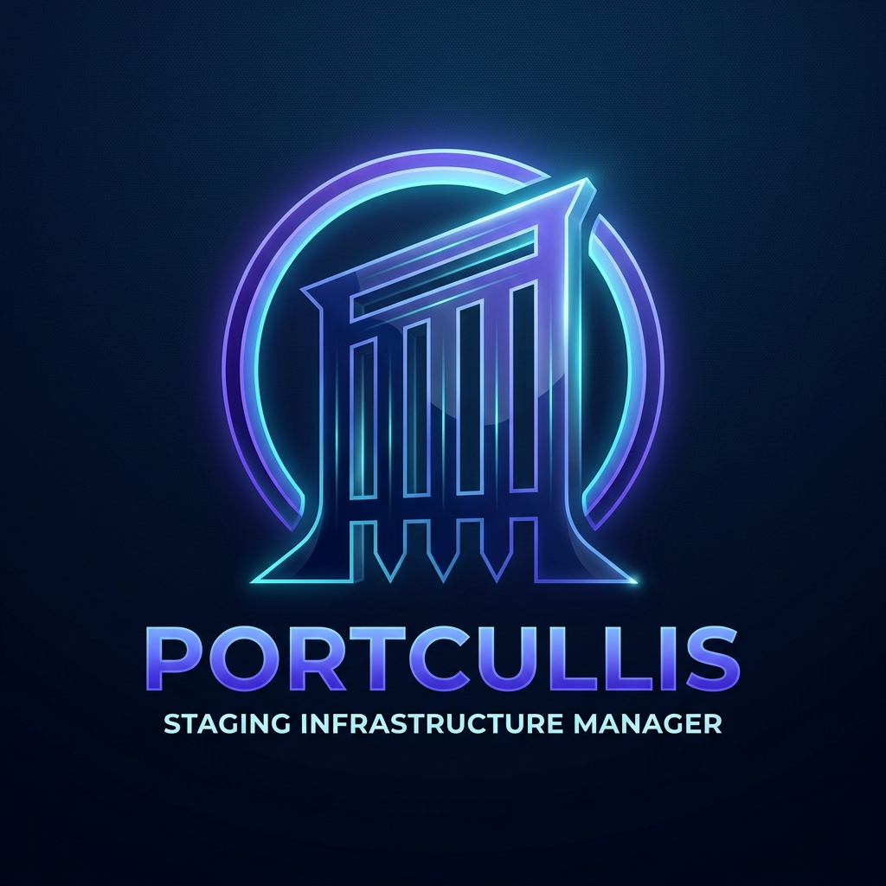

# Portcullis — Staging Infrastructure Manager

Portcullis is a self-hosted control plane for staging environments. It leverages Caddy, Next.js, and Postgres to provide a seamless registration and management interface for experimental projects.



## Features
- **Service Management**: Register and decommission staging projects via a responsive dashboard.
- **Dynamic Gateway**: Zero-restart routing via Caddy's Admin API; automatic route sync on startup.
- **Automated Provisioning**: Creates a dedicated Postgres database and user for every registered project.
- **Modern UI**: Next.js 16.2 App Router with Rspack, Tailwind CSS, and bilingual support (EN/IT).
- **PWA Ready**: Installable on mobile for management on the go.
- **Secure Architecture**: Multi-network Docker setup isolating projects from the control plane and from each other.

## Tech Stack

- **Gateway**: Caddy (Alpine)
- **Frontend/Backend**: Next.js 16.2 (Typescript, Rspack)
- **Database**: PostgreSQL 18
- **ORM**: Prisma 7
- **Infastructure**: Docker + Docker Compose

## Quick Start

### 1. Prerequisite Networks
Create the external networks required for cross-stack communication:
```bash
docker network create caddy_gateway
docker network create db_network
```

### 2. Environment Setup
Copy the example environment file and fill in your secrets:
```bash
cp .env.example .env
```

### 3. Deploy Stack
```bash
docker compose up --build -d
```

### 4. Initialize Database
Apply the initial migrations to the shared Postgres instance:
```bash
docker exec -it portcullis_nextjs_app ./node_modules/.bin/prisma migrate deploy --config ./prisma.config.js
```

## Development

See [AGENTS.md](./AGENTS.md) for detailed architecture documentation, coding conventions, and migration workflows.
