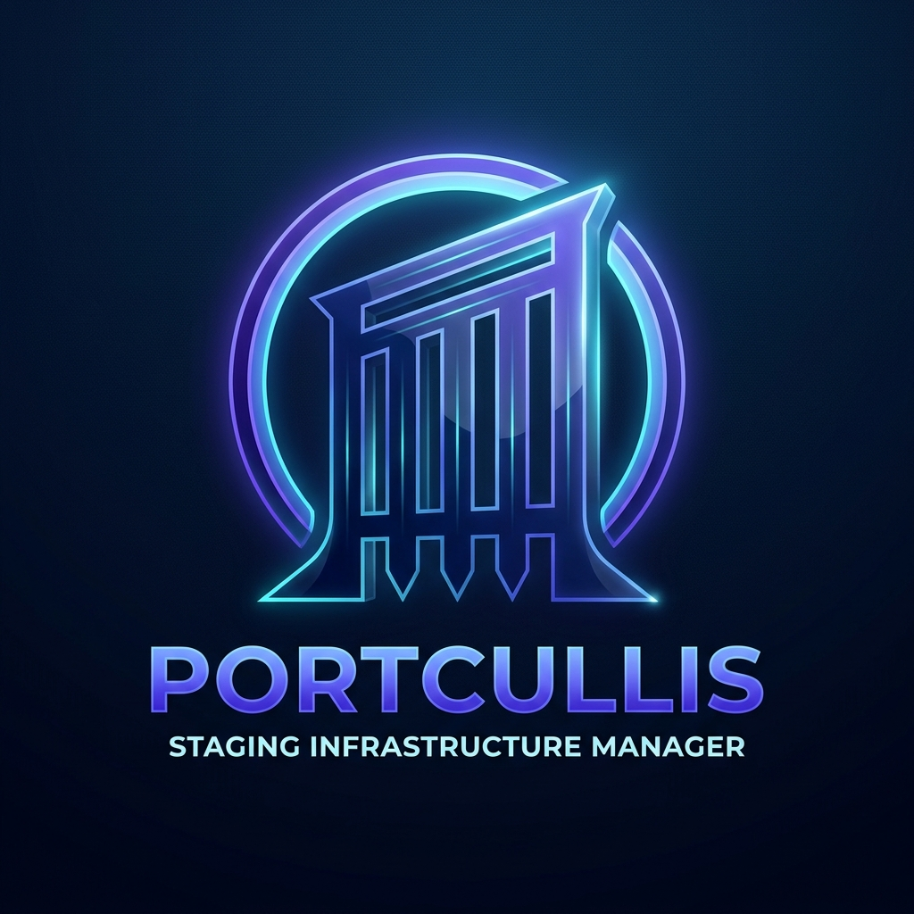

# Portcullis - Secure Public Frontend Manager

Portcullis is a secure control plane for public servers hosting multiple services. It leverages Caddy, a Go control plane, and Postgres to provide a professional registration and management interface for multi-tenant environments, optionally sharing a single database instance.



## Features

- **Go Control Plane**: Server-rendered, English-only owner dashboard (`apps/control-plane`) with cryptographically verifiable expiring sessions (ADR-0002). No Next.js, React, Prisma, or PWA surface.
- **Service Management**: Register proxy (Docker containers) and static-file services via the authenticated dashboard, protected by session-bound CSRF.
- **Multi-Domain Support**: Map multiple hostnames/domains to a single upstream service with automatic SSL.
- **Generated Caddyfiles**: Services are written to `sites/generated/<service-id>.caddy`, validated, then Caddy is reloaded with rollback safety.
- **Manual Operator Config**: Operator-owned Caddy blocks live in `sites/manual/*.caddy` and are never modified by Portcullis (read-only to the control plane).
- **Optional Provisioning**: Opt-in per-service creation of an isolated Postgres database/user with a cryptographically random password shown exactly once — never persisted or logged. Deletion of a provisioned service fails closed (no automatic decommission).
- **DNS-01 TLS**: Modular DNS challenge support for staging/internal networks without public ports. Per-provider Caddyfile snippets for NameCheap, Cloudflare, and Route53.
- **Static File Serving**: Register static sites served directly by Caddy from `/srv/sites/<domain>`, without an app container.
- **Automatic Backups**: Nightly `pg_dump -Fc` per service with daily/weekly/monthly retention tiers (7/4/3). Sidecar container, enabled via `--profile backup`; dashboard lists and downloads backups read-only.
- **On-Demand Dumps**: Session-authenticated, CSRF-protected dashboard action streaming a rate-limited `pg_dump -Fc` of a provisioned service database. No bearer token exists.
- **Explicit Migrations**: Committed versioned SQL migrations under `apps/control-plane/migrations/`, applied by a dependency-gated one-shot `migrate` Compose service; rerun-safe against the same fresh schema. No legacy Prisma compatibility (ADR-0001).
- **Container Healthchecks**: Core containers monitored with Docker healthchecks (`caddy version`, `/healthz` (database-backed), `pg_isready`). The control plane starts only after migrations completed successfully.
- **Resource Limits**: Configured `mem_limit` and `cpus` on all containers to prevent runaway processes.
- **Log Rotation**: Docker `json-file` driver with `max-size: 10m, max-file: 3` on all containers.

## Tech Stack

| Component | Technology |
|---|---|
| Gateway | Caddy (Alpine, custom build for DNS-01) |
| Control Plane | Go (net/http, server-rendered HTML, pgx) |
| Database | PostgreSQL 18 |
| Infrastructure | Docker + Docker Compose |

## Quick Start

### 1. Prerequisite Networks
```bash
docker network create caddy_gateway
docker network create db_network
```

### 2. Environment Setup
```bash
cp .env.example .env
# Edit .env: set DB credentials, PORTCULLIS_PASSCODE, and a strong
# PORTCULLIS_SESSION_SECRET (at least 32 characters).
```

### 3. Build and Start
```bash
docker compose build   # control-plane + caddy images
docker compose up -d   # migrate runs once, then the control plane starts
```

The `migrate` service applies the committed SQL migrations to the fresh
database and exits; `control_plane` depends on it completing successfully
before it starts. The registry database is disposable by design (ADR-0001):
re-running against the same fresh schema is safe, but no legacy data is
migrated.

### 4. Verify Startup

```bash
docker compose ps
docker logs --tail 100 portcullis_control_plane
curl -s -o /dev/null -w '%{http_code}\n' http://127.0.0.1:8080/healthz  # on the host, if published
```

Expected: `control_plane` healthy (`/healthz` returns 200 only when the
registry database answers), `migrate` exited 0.

## Isolated disposable smoke

`docker-compose.smoke.yml` runs the full stack (fresh database, migrations,
Go control plane, Caddy) in an isolated project — no host ports, no external
networks, no bind mounts into `./data` or `./sites`. It can never touch a
live deployment:

```bash
PORTCULLIS_PASSCODE=smoke-passcode \
PORTCULLIS_SESSION_SECRET=smoke-session-secret-0123456789abcdef \
DB_USER=smoke_owner DB_PASSWORD=smoke-db-password \
docker compose -f docker-compose.smoke.yml -p portcullis-smoke-<unique> up -d --build

# Teardown — destroys ONLY the unique project's resources:
docker compose -f docker-compose.smoke.yml -p portcullis-smoke-<unique> down -v
```

## Staging rsync deployment

For Heimdall-style staging deploys, sync from the repository root with `.rsyncignore` so runtime state is preserved:

```bash
rsync -az --delete --exclude-from=.rsyncignore \
  ./ \
  dietpi@Heimdall:/srv/portcullis/
```

The ignore file protects local dependencies, build outputs, secrets, Postgres data, and operator/runtime Caddy state.

Then on the server: `cd /srv/portcullis && docker compose up --build -d`.

**Cutover is a destructive, separately authorized operation** — see
`Projects/Portcullis/runbooks/` in the Piren vault for the reviewed
cutover/rollback runbook. Do not reset or migrate the existing database
without explicit steward approval.

## DNS-01 Configuration

Portcullis supports these TLS modes:

```text
acme
internal
namecheap_tls
cloudflare_tls
route53_tls
```

For staging/internal networks without public port 80, use DNS-01:

```env
# .env
CADDY_TLS_MODE=namecheap_tls    # or cloudflare_tls, route53_tls
CADDY_DNS_PROVIDER=namecheap    # for Docker image build
NAMECHEAP_API_KEY=your_api_key
NAMECHEAP_API_USER=your_username
```

Then rebuild Caddy with the DNS plugin: `docker compose build caddy`

## Wildcard certificate spike

Wildcard support is intentionally a staging spike before it becomes a dashboard feature. Use the committed safe template and runbook:

```text
sites/manual/wildcard-spike.caddy.example
docs/p6-wildcard-certificate-spike.md
```

The template is not imported by default. Copy it to `sites/manual/wildcard-spike.caddy` only on Heimdall when ready to prove DNS-01 wildcard issuance.

## Service Migration (graduation)

When a provisioned service outgrows Portcullis and moves to its own VPS, use the **On-Demand Dump** dashboard action (owner session + CSRF) to stream a `pg_dump -Fc` archive, then pipe it into `pg_restore` on the new host:

```bash
pg_restore -h localhost -U postgres -d new_db service.dump
```

The dump is rate-limited to one per service per five minutes and carries no bearer token.

## Development

- Go control plane: see `apps/control-plane/README.md`.
- Historical legacy Next.js guidance: [AGENTS.md](./AGENTS.md) (historical only; the Go control plane supersedes it).
